# Assignment 1 - Kinematic walking controller

**Hand-in:** March 25, 2026, 18:00 CEST

**Important:**
Before you submit your final commit, please make sure:
1. Your code builds without any errors
2. Leave your name, student ID, ETH email address, and all required demo video links in the `my-info.json` file.

# Introduction

In this assignment, we implement a kinematic walking controller for two legged robots with different morphologies!
It contains two parts, one for quadruped robots and the other for hexapod robots.

Let's start with the quadruped robot with the figure below.

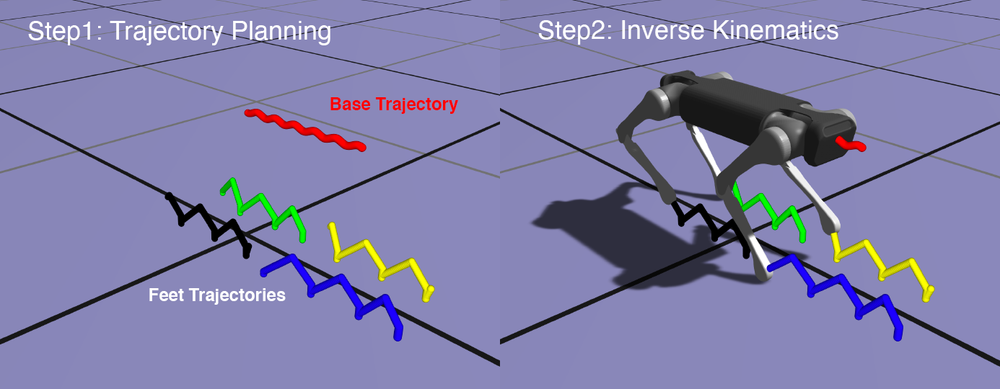

*Figure 1: The control pipeline of kinematic walking controller: 1) trajectory planning 2) computing desired joint
angles by IK.*

We start from five trajectories: 1 for base, and other 4 for feet. We plan the trajectories given target velocity of the
robot base (body) and a timeline of the foot contacts (i.e. *when* and *how long* does a foot contact with a ground.)
For our assignment, we will provide code for and omit the details of how we plan the timeline of foot contacts, and how we generate the target trajectories.
But in Ex.2-3, we will have a sneak peek of *trajectory planning* procedure for the robot's base, and in Ex.5, we will have a chance to play with different contact timelines for the MiniPi first, and then the hexpod robot.

Our goal is tracking all the five target trajectories at the same time. We will simplify this problem by assuming the
robot's base (somehow...) always perfectly tracks a target base trajectory. Then, we want to find **desired joint
angles** for each leg that allow the foot (i.e. the end effector of individual leg) to reach a target position. We can
effectively formulate this as an IK problem. Since the robot has four legs, by solving four IK problems, we can obtain
desired configuration of the robot.

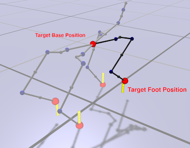

*Figure 2: Don't freak out!, this is a skeletal visualization of our Dogbot. Assuming the base is at the target
position, we want to find **desired joint angles** for each leg that allow the foot (i.e. the end effector of individual
leg) to reach its corresponding target position. Note. You can render skeletal view by Main Menu > Draw options > Draw
Skeleton.*

# Hand-in and Evaluation

This assignment consists of two parts: quadruped and hexapod.

Quadruped part (70%, baseline): 
- Ex.1   Forward kinematics of robot feet (10%)
- Ex.2-1 Jacobian by FD (10%)
- Ex.2-2 IK Solver by Gauss-Newton (10%)
- Ex.2-3 Base trajectory planning (10%)
- Ex.3 Analytic Jacobian (20%)
- Ex.4 Uneven terrain (10%)

Hexpod part (30%, advanced):
- Ex.5 Gait patterns on MiniPi and HexPod - defining foot contact timeline (20%)
- Ex.6 Deploy on the real hexpod hardware (10%)

The sub-questions build upon the previous ones, so it is recommended to solve them in order.

To complete this assignment, you should hand in

- code pushed to your github repository.
- a link to a short video demonstrating Ex.4 implementation (in `my-info.json`).
- a link to a short video demonstrating Ex.5.1 (MiniPi) implementation (in `my-info.json`).
- a link to a short video demonstrating Ex.5.2 (HexPod) implementation (in `my-info.json`).
- To get access to the hardware for Ex 6, you must provide a successful video demonstration of your simulation to the TA. 

**There are two hardware experiment sessions available on the tutorial sessions on Mar 12 and Mar 19.**
We will have a small competition to see who can make the robot walk the furthest! (no extra credit given for the winner, and you will get the points as long as your robot walks, but a small prize will be given to the winner 🏆)

The detailed grading scheme is as follows:
- Ex.1-3 will be evaluated by an auto grading system **after the deadline**. (the test sets are **not visible** to
  you)
- Ex.4-5 will be evaluated based on your demo video.
- Ex.6 will be evaluated based on your hardware experiment result.

**IMPORTANT:** If your code is not built successfully, you will get **zero** point from this assignment. So make sure
your code is built without any build/compile error.

**IMPORTANT:** If the system detect a suspected plagiarism case or an unfair use of AI generated answer, you will get **zero** point from this assignment.

Please leave your questions on GitHub (the public template one), so your colleagues also can join our discussions.

# Exercises

Okay now let's do this step-by-step :)

## Ex.1 Forward Kinematics of feet

In order to formulate an IK problem, firstly, we have to express the positions of a foot as functions of joint angles (
and the base position). Formally speaking, given a *generalized coordinates* vector

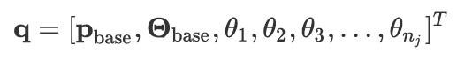

which is a concatenated vector of position of robot's base, orientation of robot's base and n<sub>j</sub> joint angles,
we need to find a map between **q** vector and end effector position **p**<sub>EE</sub> expressed in world coordinate
frame.

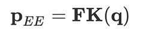

In the previous lecture, we learned how to find this map by **forward kinematics**.

**Code:**

- Files:
    - `src/libs/simAndControl/robot/GeneralizedCoordinatesRobotRepresentation.cpp`
- Functions:
    - ```P3D getWorldCoordinates(const P3D &p, RB *rb)```

**Task:**

- Implement forward kinematics for point **p**.

**Details:**

- ```GeneralizedCoordinatesRobotRepresentation``` represents the generalized coordinate vector **q**.
- ```P3D getWorldCoordinates(const P3D &p, RB *rb)``` returns position of a point in world coordinate frame. The
  arguments `p` is a position of the point in rigidbody `rb`'s coordinate frame.
- You may want to implement ```getCoordsInParentQIdxFrameAfterRotation(int qIndex, const P3D &pLocal)``` first: this
  function returns position of a point in the coordinate frame of the parent of `qIdx` after the DOF rotation has been
  applied.

Once you implement ```getWorldCoordinates``` function correctly, you will see green spheres around feet of the robot.

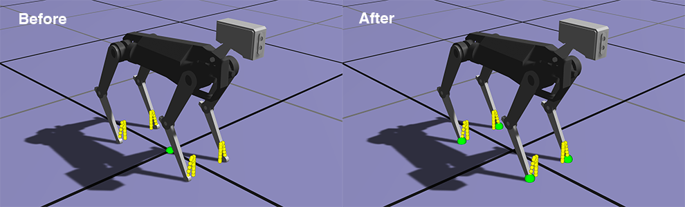

*Figure 3: Check if your implementation is correct. You should see the green spheres around the robot's feet.*

## Ex.2-1 Inverse Kinematics - Jacobian by Finite Difference

Okay, now we can express the position of the feet as a function of joint angles. It's time to formulate an IK problem:
we want to find a generalized coordinate vector **q**<sup>desired</sup> given end effector target position **p**<sub>
EE</sub><sup>target</sup>.

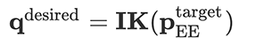

In the lecture, we learned how to formulate the inverse kinematics problem as an optimization problem.

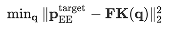

We can solve this problem using [gradient-descent method](https://en.wikipedia.org/wiki/Gradient_descent)
, [Newton's method](https://en.wikipedia.org/wiki/Newton%27s_method_in_optimization),
or [Gauss-Newton method](https://en.wikipedia.org/wiki/Gauss%E2%80%93Newton_algorithm). Whatever optimization method you
choose, we need a [Jacobian matrix](https://en.wikipedia.org/wiki/Jacobian_matrix_and_determinant) of the feet point.
Remember, Jacobian is a matrix of a vector-valued functions's first-order partial derivatives.

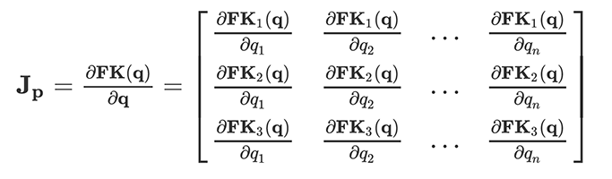

For now, we will use finite-difference (FD) for computing Jacobian. The idea of finite difference is simple. You give a
small perturbation *h* around jth component of **q**, and compute the (i,j) component as follows.

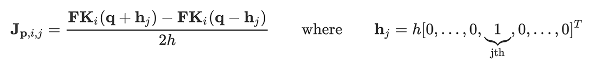

**Code:**

- Files:
    - `src/libs/simAndControl/robot/GeneralizedCoordinatesRobotRepresentation.cpp`
- Functions:
    - ```void estimate_linear_jacobian(const P3D &p, RB *rb, Matrix &dpdq)```

**Task**:

- Complete ```estimate_linear_jacobian``` functions that computes a Jacobian matrix of position/vector by FD.

**Details:**

- We use [central difference](https://en.wikipedia.org/wiki/Finite_difference#Basic_types) with a perturbation *h*
  0.0001.

## Ex.2-2 Inverse Kinematics - IK Solver

With the Jacobian ready, it's time to implement a IK solver. 
We will use **Gauss-Newton** methods we learned in the previous lecture.

We solve four independent IK problems (one for each leg.) 
Let's say **q**<sup>desired,i</sup> is a solution for ith feet.

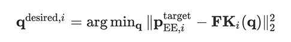

We can just solve each IK problem one by one and sum up the solutions to get a full desired generalized coordinates **q**<sup>desired</sup>.

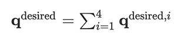

**Code:**

- Files:
    - `src/libs/simAndControl/kinematics/IK_Solver.h`
- Functions:
    - ```void solve(dVector &q, int nSteps = 10)```

**Task**:

- Implement an IK solver based on the Gauss-Newton method.

**Details:**

- Use Jacobian matrix computed by `gcrr.estimate_linear_jacobian(p, rb, dpdq)` we implemented for Ex. 2-1.
- I left some useful hints on the source code. Please read it carefully.
- When you overwrite eigen matrix variable values in a single statement, you should use ```eval()``` function to prevent
  corruption. (note. this is caused by *aliasing*. See [this](https://eigen.tuxfamily.org/dox/group__TopicAliasing.html)
  for more details.) For example,

```cpp
// overwrite Matrix J in a single statement
// use eval() function!
J = J.block(0,6,3,q.size() - 6).eval();
```

Let's see how the robot moves. Run ```locomotion``` app and press **Play** button (or just tap **SPACE** key of your
keyboard). Do you see the robot trotting in place? Then you are on the right track!

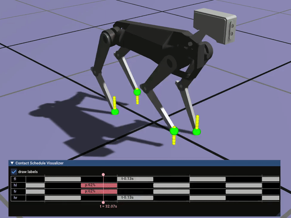

## Ex.2-3 Trajectory Planning

Now, let's give some velocity command. Press **ARROW** keys of your keyboard. You can increase/decrease target forward
speed with up/down key, and increase/decrease target turning speed with left/right key. You can also change the target
speed in the main menu.

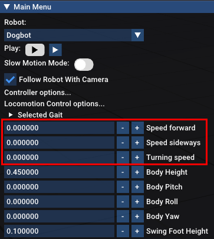

Oops! The base of the robot is not moving at all! Well, a robot trotting in place is already adorable enough, but this
is not what we really want. We want to make the robot follow our input command.

Let's see what happens here. Although I'm giving 0.3 m/s forward speed command, the target trajectories (red for base,
yellow for feet) are not updated accordingly. With a correct implementation, the trajectory should look like the one on the right below:

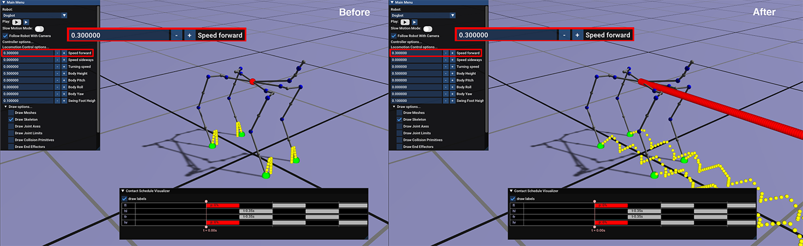

*Figure 4: Before (left) and after (right) correctly implementing the base trajectory planning. The red line is the target trajectory of the base. The yellow is for the feet.*

**Code:**

- Files:
    - `src/libs/simAndControl/locomotion/LocomotionPlannerHelpers.h`
- Class:
    - `bFrameReferenceMotionPlan`
- Function:
    - ```void generate(const bFrameState& startingbFrameState)```

**Task**:

- Your task is completing ```generate``` function so that it updates future position and orientation according to our
  forward, sideways, turning speed commands.

**Details:**

- We plan the target base trajectory by numerical integration: we integrate forward, sideways and turning speed to get
  future position and orientation.

Once you finish this step, you can now control the robot with your keyboard.

By the way, planning the feet trajectories is a bit more tricky. I already implemented a feet trajectory planning
strategy in our code base so that once you complete ```generate``` function, the feet trajectory is also updated by user
commands. 

We will not dive into the details of the feet trajectory planning here, but if you are interested, please read the paper, *Marc H. Raibert et al., Experiments in Balance with a 3D One-Legged Hopping Machine, 1984*. 
Although this is a very simple strategy, its legacy is long-lived and almost every state-of-the-art legged robot is still using this simple heuristic today. 
(Sidenote. Marc Raibert, who was the group leader of [Leg Laboratory, MIT](http://www.ai.mit.edu/projects/leglab/home.html), later founded [Boston Dynamics Company](https://www.bostondynamics.com/) in 1992.)

-----

From this point, we have a working kinematic walking controller for a quadruped robot in simulation - please pat yourself on the back! 🥳 From now on, we will improve our kinematic walking controller.

## Ex.3 Analytic Jacobian

Okay, we compute Jacobian matrix with FD. 
But in general, FD is not only inaccurate but also very slow in terms of
computation speed. Can we compute Jacobian matrix analytically? 
The answer is yes. With a small extra effort, we can derive analytic Jacobian matrix, and implement this into our code.
You might find the [note](https://moodle-app2.let.ethz.ch/mod/resource/view.php?id=1193025) for Jacobian derivation of an 2D IK problem on Moodle useful.

**Code:**

- Files:
    - `src/libs/simAndControl/robot/GeneralizedCoordinatesRobotRepresentation.cpp`
- Functions:
    - ```void compute_dpdq(const P3D &p, RB *rb, Matrix &dpdq)```

After completion, you should notice your simulation is running faster and less laggy than before!

### Testing Your Implementation

We provide a suite of student-facing (public) tests covering Ex.2 and Ex.3 to help you catch common implementation mistakes before submission. Run them all at once or per-exercise with:

```bash
# Run everything in a batch
cd build
ctest -R test-a1-

# Or run per exercise
ctest -R test-a1-ex2-
ctest -R test-a1-ex3-
```

<details>
<summary>if you prefer a more graphical interface for building and testing (click to expand)</summary>

1. Install extensions:
   - [CMake Tools](https://marketplace.visualstudio.com/items?itemName=ms-vscode.cmake-tools)
2. Open this folder in VS Code, then run `CMake: Select a Kit` and pick your compiler.
3. Run `CMake: Configure` and `CMake: Build`.
4. Open the **Testing** panel in VS Code to discover and run tests (or continue using `ctest` in terminal).

More details:
- CMake Tools docs: <https://github.com/microsoft/vscode-cmake-tools/tree/main/docs>
- VS Code Testing docs: <https://code.visualstudio.com/docs/debugtest/testing>
</details>


Public test targets are:

- `test-a1-id-check`: validates `my-info.json` content and video URL reachability.
- `test-a1-ex2-fk-independence`
- `test-a1-ex2-fd-base-dofs`
- `test-a1-ex2-traj-dt`
- `test-a1-ex2-traj-base-integration`
- `test-a1-ex3-analytic-base`
- `test-a1-ex3-analytic-all-limbs`: analytic Jacobian vs FD check across all quadruped limbs.

If any test fails, read the error message it prints and fix your implementation before committing.

**Passing all of these tests is a necessary but not sufficient condition for passing the full auto-grading suite.** The visible tests cover common pitfalls at a single robot configuration. The hidden autograder uses a broader set of robot models, poses, and edge cases — so implement general, robust logic rather than optimizing for this small visible set.

**IMPORTANT:** Once you have verified that your analytic Jacobian works correctly with both the tests and the locomotion app, revert to using the FD-based Jacobian for your final commit on `main`. The auto-grader for Ex.2-2 is designed around the FD-based Jacobian; leaving the analytic one active may cost you points on that exercise.

## Ex.4 Uneven Terrain

Our robot can go anywhere in the *flat-earth world*. But, you know, our world is not flat at all. Now, we will make our
robot walk on an bumpy terrain. Imagine you have a height map which gives you a height of the ground of given (x, z)
coordinates (note that we use y-up axis convention i.e. y is a height of the ground.) To make the robot walk on this
terrain, the easiest way is adding offset to y coordinates of each target positions.


You have a full freedom to choose the terrain map you want to use: you can just create a bumpy terrain by adding some
spheres in the scene as I've done here. Or you can download a landscape mesh file in **.obj** format (there's an example
terrain obj file in data folder). Please figure out the best strategy to implement this by your own.

**IMPORTANT:** Since the implementation of `ex.4` might break our auto-grade system designed for ex.1-3, please create a new git branch named ```ex4``` and push your code there while your implementation of Ex.1-3 still remains in main branch. 
If your Ex.4 implementation breaks Ex.1-3, you may not get full points from Ex.1-3.

If you are not familiar with git branching, you can learn more about how to create a branch from [here](https://git-scm.com/book/en/v2/Git-Branching-Basic-Branching-and-Merging).

**Task**:

- Make the robot walk on an uneven terrain.
- Visualize your terrain in ```locomotion``` app.
- **Please record a video ~ 20 secs demonstrating your implementation. The robot in the video should walk on an uneven
  terrain, and your video should be visible enough to see how well your controller performs the task. Upload it to
  YouTube or any other video hosting website and add its link to the `Demo video URL for ex.4` entry of the `my-info.json` file.**
  If I cannot play or access your video until the deadline, you won't get full points.
- Please adjust your camera zoom and perspective so that your robot is well visible in the video. You may not get full
  point if your robot is not clearly visible.

**Hint:**

- We want to give y-offset to IK targets. But remember, offset value for each target could be different.
- Do not change ```double groundHeight = 0;``` in ```SimpleLocomotionTrajectoryPlanner```. This will merely give the
  same offset to every target trajectory. We want to give different offset for each individual foot and the base.

## Ex.5 Defining foot contact timeline for MiniPi and HexPod robots

In this exercise, you will define gait patterns for two new robots: a biped (MiniPi) and a hexapod (SpiderPi). Both use the same IK solver and locomotion planner you built for the quadruped — only the foot contact timeline changes.

**IMPORTANT:** Same as Ex.4, this exercise will likely break the auto-grade system designed for Ex.1-3, so create a new git branch named `ex5` and push your code there, while your implementation of Ex.1-3 remains in the main branch.

**Code to change:**

- Files:
    - `src/app/app.h`
- Class:
    - `App`
- Function:
    - `PeriodicGait getPeriodicGait(LeggedRobot *robot)`

You don't need to change anything in the low-level gait generation code in `src/libs/simAndControl/locomotion/FootFallPattern.h`, but feel free to read it to understand the input/output and the code logic.

### 5.0 Gait Patterns: Concept

Before diving into the exercises, let's unpack the foot contact timeline concept, which is also called a **gait pattern** in locomotion literature.

In legged locomotion, we divide the gait cycle into two phases: **stance** and **swing**.
The stance phase is when the foot is in contact with the ground, and the swing phase is when the foot is in the air (see figure below).

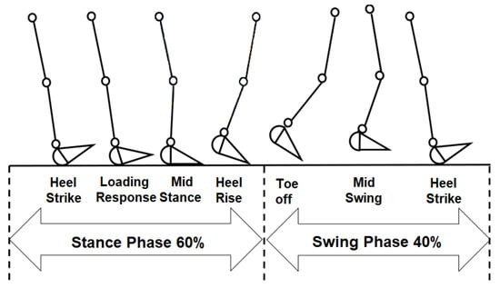

*Figure 5: stance and swing phase of a gait cycle. Image from [Aqueveque et al. 2020](https://www.mdpi.com/1424-8220/20/3/656).*

In our code, the gait pattern is defined by specifying the **start and end time of the swing phase** for each leg (as a relative timestamp in [0, 1] within a full gait cycle), and the **stride duration** (total time in seconds of one full cycle).
The following code defines the trotting gait we used for the quadruped Dogbot:

```cpp
  double tOffset = 0.0;
  pg.addSwingPhaseForLimb(robot->limbs[0], 0.0 - tOffset, 0.5 + tOffset);
  pg.addSwingPhaseForLimb(robot->limbs[1], 0.5 - tOffset, 1.0 + tOffset);
  pg.addSwingPhaseForLimb(robot->limbs[2], 0.5 - tOffset, 1.0 + tOffset);
  pg.addSwingPhaseForLimb(robot->limbs[3], 0.0 - tOffset, 0.5 + tOffset);
  pg.strideDuration = 0.7;
```

In a trot, diagonal leg pairs swing simultaneously: limbs[0] and limbs[3] swing together, then limbs[1] and limbs[2] swing together. Each leg spends exactly half the cycle in the air.

*Note on gait patterns in the wild:* For animals, the gait pattern varies depending on the species, speed, and terrain.
For example, a dog's gait patterns for pacing, trotting, and galloping are all fascinatingly different (see [this video](https://www.youtube.com/watch?v=WrR3fVQ3W3s)).
[This video](https://www.youtube.com/watch?v=tLrRlXxM5Yw) provides an interesting perspective on quadrupedal animal locomotion from an animation perspective.

### 5.1 Biped (MiniPi)

Switch to the MiniPi robot by changing the robot model index to `1` in line 45 of `src/app/app.h`:

```cpp
setupRobotAndController(robotModels[1]);
```

The MiniPi has **2 limbs**. Your task is to define a gait pattern in the `robot->limbs.size() == 2` branch of `getPeriodicGait` that makes the MiniPi walk in a coordinated way.

**Task:**

- Define a foot contact timeline for the MiniPi so that its legs alternate in a sensible walking pattern.
- **Please record a video of ~20 seconds showing your Ex.5.1 MiniPi result, upload it to YouTube (or another openly accessible host), and add the link to `Demo video URL for ex.5.1 (MiniPi)` in `my-info.json`.** If the video is inaccessible before the deadline, you may lose points.

**A note on expected behavior:** Even with a perfectly correct gait pattern, the MiniPi's walking may look strange or unstable. This is somewhat expected — and understanding *why* is part of the exercise.

**Reflection task:** Create a short Markdown file `ex5-biped-reflection.md` in the repository root and write 3-5 sentences explaining:
- Why does a biped robot walking with this kinematic controller look unnatural or unstable, even with a correct gait pattern?
- What would be needed (algorithmically) to make it walk more naturally?
- If you were to deploy this generated motion directly onto a real biped hardware, what do you think would happen? What assumptions does our kinematic walking controller make about the robot, and do those assumptions hold for a biped?

### 5.2 Hexapod (SpiderPi/HexPod)

Once your MiniPi gait is working (even if the result looks a bit odd), switch to the HexPod by changing the robot model index to `2`:

```cpp
setupRobotAndController(robotModels[2]);
```

**Task:**

- Define a foot contact timeline in the `robot->limbs.size() == 6` branch of `getPeriodicGait` that makes the HexPod walk in a coordinated and stable way. You are free to adapt a pattern from the literature or invent your own — there are fewer conventions for hexapods than for quadrupeds, so be creative!
- **Please record a video of ~20 seconds showing your Ex.5.2 HexPod result, upload it to YouTube (or another openly accessible host), and add the link to `Demo video URL for ex.5.2 (HexPod)` in `my-info.json`.** If the video is inaccessible before the deadline, you will not receive full points.
- Adjust your camera zoom and perspective so the robot is well visible. You may lose points if the robot is not clearly visible in the video.

**Stability hints:**

If you observe legs flying around erratically, the foot and base trajectories are making the IK solver unstable. Common causes:

1. The base height is too high and foot placements are unreachable. Tune these parameters:
    - Target robot body height.
    - Step Width Ratio.
    - Swing Foot Height.

2. The robot base is moving too fast for the feet to keep up. Try reducing the forward speed, the total stride duration, or the swing fraction.

To proceed to the hardware experiment in Ex.6, make sure your robot's legs are stable — not flipping back and forth — and that joint angles stay within a reasonable range. Otherwise, you risk damaging the hardware.

While there are plenty of materials on quadrupedal gait patterns, there are fewer resources on hexapod gait patterns, so feel free to explore the literature or be inventive.
In the tutorial session, we will have a small competition to see who can make the robot walk the fastest (while staying safe)!

## Ex.6 Deploying the kinematic trajectory on a real hexpod robot

The box-like hexpod robot we have been playing with actually represents the kinematic model of the [SpiderPi robot from Hiwonder](https://www.hiwonder.com/products/spiderpi?variant=40213126381655).

- Select your best gait pattern and the right forward walking speed (no turning and sideway speed) and record a trajectory.
- Click on the `Record Trajectory to a JSON file` button in the app to start recording, and it will stop the recording automatically after a fixed number of frames.

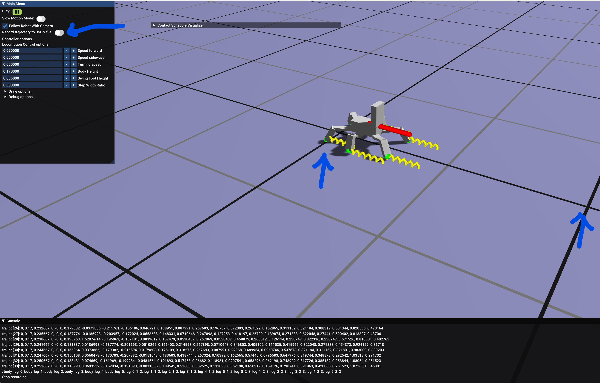

You should find a `trajectory.json` file in the `data` folder. Copy that file to the google drive link that will be shared with you through Moodle announcement.
We will replay this trajectory on the real robot during the tutorial session!

# Final Notes

Congratulations! You can now control the legged robot! Hooray! 🤖🥳
We have implemented one of the fundamental building block of legged locomotion control. 

For those of you who successfully deployed the kinematic trajectory on the real hexpod robot, you can notice some caveats between the simulation and the real robot. 
We are using an open-loop position control to track your trajectory.
Why do you think the real robot is not following the trajectory exactly as the simulation?

And you might also wonder if we can deploy the kinematic trajectory on the real quadruped robot just like the hexpod?
Well... unfortunately it's not very easy. 
In fact, working with a real robot is a completely different story because we need to take into account **Dynamics** of the robot. 

Below is a video on using a PD controller to track this kinematic trajectory on a quadruped robot in a physics simulator (click image to play):

[](https://www.youtube.com/watch?v=PfeJYcg-yk0)

Can you make a guess why using kinematic controller for a real legged robot doesn't really work well in practice? Can you give an explanation on why the robot jumps in the video above? Is there ways to fix this issue?

If you are interested, please leave your ideas on the GitHub issue!


# Frequently Asked Questions

<details>

**Q**: Is it okay to hard code length of the links for the exercises?

**A**: No. Your implementation should be general for ANY kinematic tree. And should work for the quadruped, biped, and hexpod robots without changing any low-level code for FK/IK computation.

------

**Q**: The feet of the robot are under the ground when I play the app.

**A**: Once you complete the IK solver, the robot's base and feet will follow the position target.

------

**Q**: Do we need to use analytical Jacobian for IK solver?

**A**: No. Let's stick to numerical Jacobian for IK solver for the final submission.

-----

**Q**: Can I increase the number of IK iteration?

**A**: Yes. But if you use Gauss-Newton method, 10 will be enough.

-----

**Q**: (Ex.4) Do I need to generate trajectory considering the terrain height? 

**A**: No. Adding offset (ground height) to IK target is just enough. Either way, if your robot walk on the terrain without any problem, we consider it as a successful implementation. 

-----

**Q**: Should I always use hint, or is it just okay to ignore it. 

**A**: Of course it's totally fine to ignore hints we provided. But please remember, if your implementation causes some side effects (e.g. some state changes of the robot that was not expected or not intended) although your implementation seemingly do the right thing, you may lose some points. So I strongly recommend you to stick to hints and our guides as much as possible. 

------
**Q**: Often the knee of the robot snap to the other way  as the following image 


**A**: We don't take into account joint limit in our IK, so it's very normal. Specifically, if a leg is in near singularity condition (due to too high forward speed command etc.) this can happen. But, if this happens too often, you should do a double check if something wrong in your implementation.

------

**Q**: My code crashes. I want to know on which line the code crashes. 

**A**: If you build your code in **Debug** mode and run a debugger, the debugger will let you know on which line the code crashes.


------

**Q**: App is extremely slow... 

**A**: Make sure you build and run your code in **Release** mode. 

------

**Q**: How does ```test-a1``` work (exercise 4)?

**A**: ```test-a1``` compares the value of each entry of *analytic* Jacobian  and *numerical* Jacobian (the one computed by the finite difference) for a given robot configuration. If the difference is less than a tolerance, the test code decides the test is passed. Here, we assume your *numerical* Jacobian (you implemented in Ex.2) is correct. If that's not the case, the test code may fail although your *analytic* Jacobian is correct. 

</details>

# Acknowledgement

This assignment is adapted from a previous version developed by [Dongho Kang](https://donghok.me/).

The robot kinematic model for the SpiderPi hexpod robot is adapted from a URDF that is kindly shared by [Tomson Qu](https://www.linkedin.com/in/tomson-qu-7a9962204/), [Zixian Zang](https://www.linkedin.com/in/zixian-zang/), and [Prof. Avideh Zakhor](https://www2.eecs.berkeley.edu/Faculty/Homepages/zakhor.html) from UC Berkeley.
Check out their cool work on learning versatile and perceptive locomotion skills for hexpod robots [here](https://arxiv.org/abs/2412.10628) and [here](https://ieeexplore.ieee.org/document/10341957/).
[Fatemeh Zargarbashi](https://www.linkedin.com/in/fatemeh-zargarbashi/) helped to convert the hexpod urdf to the rbs format.
